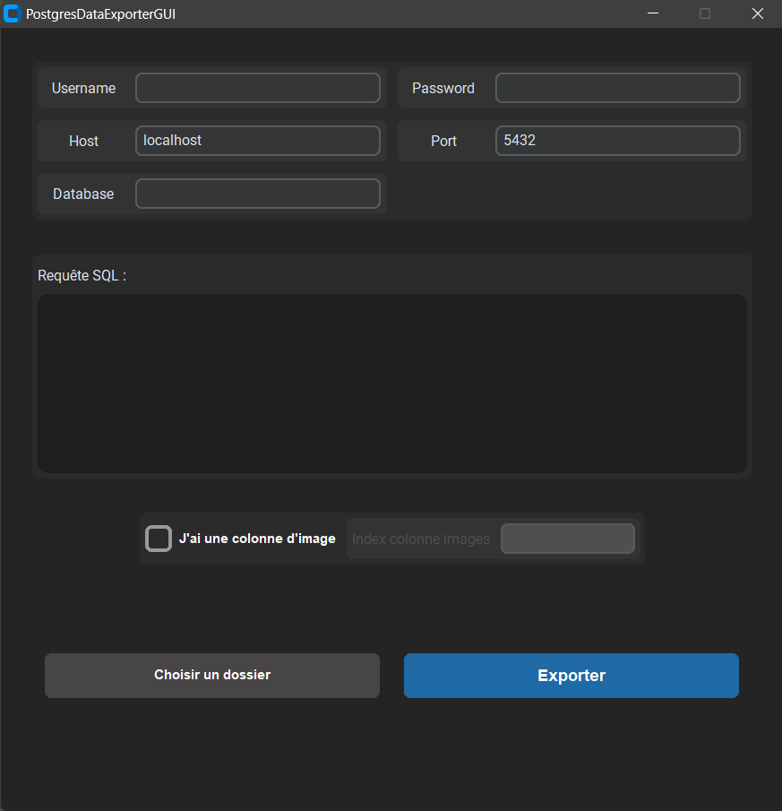

# PostgresDataExporterGUI

PostgresDataExporterGUI is a Python application that allows you to export data from a PostgreSQL database to a CSV file with the option to include images. The application provides a graphical user interface (GUI) for ease of use.


## Table of Contents
- [Screenshots](#screenshots)
- [Feature](#feature)
- [Requirements](#requirements)
- [Installation](#installation)
- [Usage](#usage)
- [License](#license)


## Screenshots



## Feature

#### Database Connection
- Ability to input PostgreSQL database connection details, including username, password, host, port, and database name.
- Error handling for database connection exceptions.

#### SQL Query Execution
- Input area for entering SQL queries to fetch data from the database.
- Handling of database query exceptions.

#### Data Export to CSV
- Export fetched data to a CSV file.
- Option to include images in the exported data.
- Ability to choose the export directory.
- CSV file includes a column for images with image files saved in a specified directory.

#### GUI Components
- Customized Tkinter-based GUI with various components, including input fields, checkboxes, buttons, progress bars, and text areas.

#### Exception Handling
- Custom exceptions (`DBConnectionException`, `DBQueryException`, `ExportCSVException`, `SaveImageException`) for handling specific error scenarios.

#### Virtual Environment and Dependency Management
- Instructions for creating and activating a virtual environment.
- Installation of project dependencies from the `requirements.txt` file.


## Requirements
- Python 3.10 or later
- Dependencies listed in `requirements.txt`


## Installation
1. Clone the repository:
    ```bash
    git clone https://github.com/Macktireh/PostgresDataExporterGUI.git
    ```
    ```bash
    cd PostgresDataExporterGUI
    ```

2. Create a virtual environment and activate it:
    ```bash
    python -m venv .venv
    ```

    *for MacOS or Linux*
    ```bash
    source .venv/bin/activate
    ```

    *for Windows*
    ```bash
    .\.venv\Scripts\activate
    ```

3. Install dependencies:
    ```bash
    pip install -r requirements.txt
    ```


## Usage
1. Run the application:
    ```bash
    python app.py
    ```

2. The GUI will appear, allowing you to input database connection details, a SQL query, and specify options for data export.

3. Click on the "Choisir un dossier" button to choose the export directory.

4. Click on the "Exporter" button to execute the data export process.


## License

This project is licensed under the [MIT License](LICENSE).
